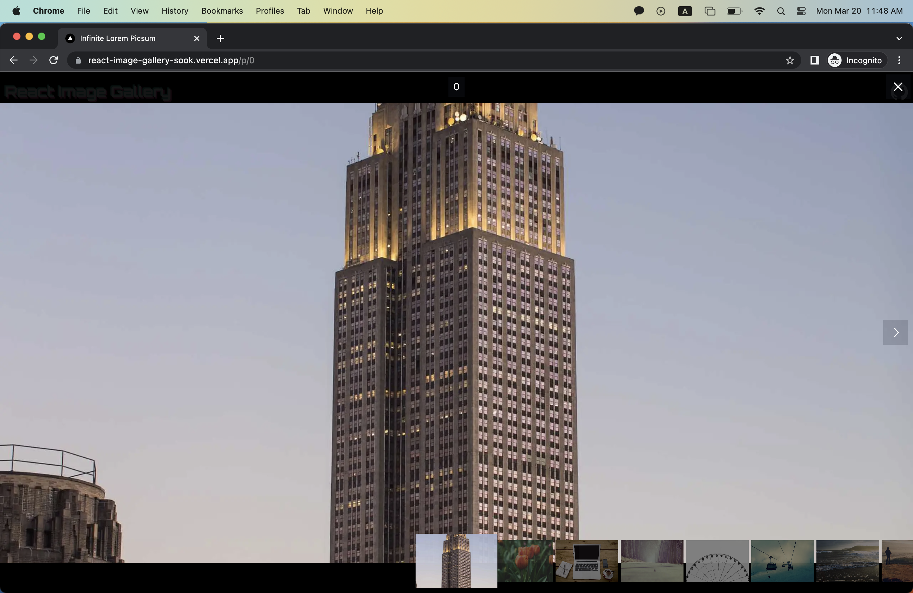

# React Image Gallery Example

Live at [https://react-image-gallery-sook.vercel.app/](https://react-image-gallery-sook.vercel.app/)

## Introduction

This website features a list of images and an image viewer that pops up when one of the images in the list is clicked.

### Image List

### Image Viewer

## Features

- Virtualized list and infinite scrolling
- Responsive design for the image list
  - from a single column up to three columns depending on the screen size
- Low-quality image preview while the main image is loading.
- Skeleton animation while the image is loading.
- Scale-down animation when the image is loaded.
- Image optimization with _srcset_ and _sizes_.
- Slide-in and slide-out animations in the image viewer.
- Maximum space allocation for the main image in the viewer depending on its aspect ratio.
- keyboard navigation support (arrow-left, arrow-right)
- drag navigation support (swipe-left, swipe-right)
- toggle on/off heads-up display in the image viewer
  - arrow-up, arrow-down
  - on click

## Built with

- [React.js](https://react.dev/)
- [Next.js](https://nextjs.org/)
- [tailwindcss](https://tailwindcss.com/)
- [Radix UI](https://www.radix-ui.com/)
- [Framer Motion](https://www.framer.com/motion/)
- [TanStack Virtual](https://tanstack.com/virtual/v3)
- [Immer](https://immerjs.github.io/immer/)
- [Lorem Picsum API](https://picsum.photos/)
